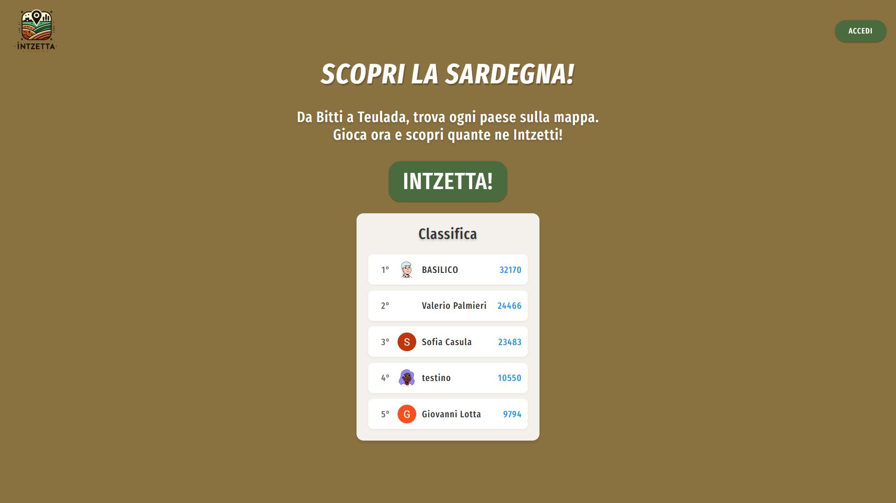
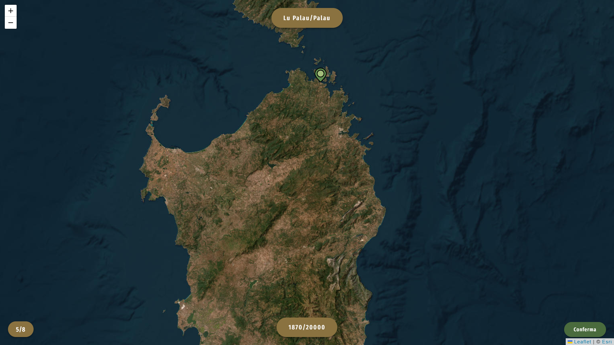
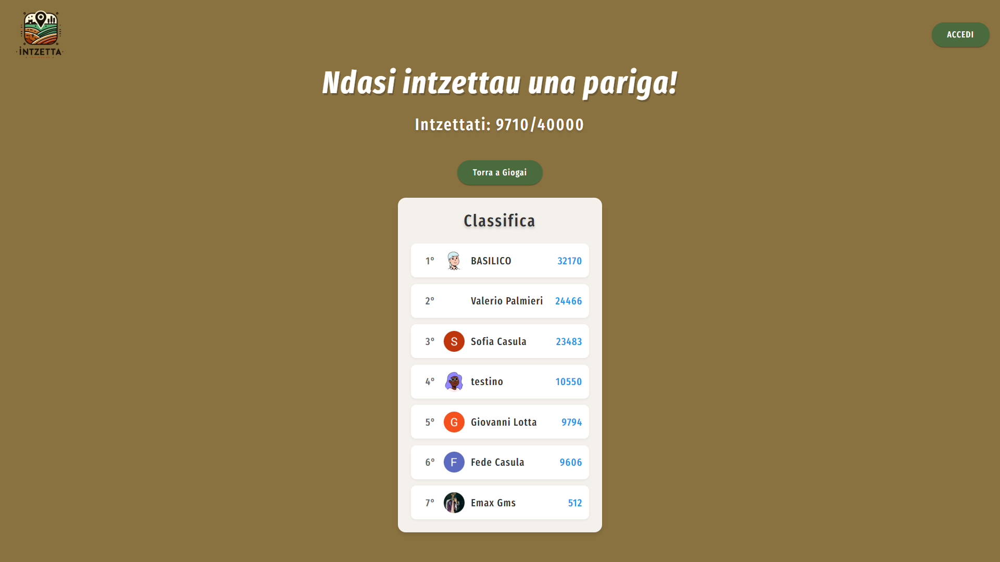

# Intzetta 🎯

**Intzetta** è un gioco interattivo che ti sfida a scoprire i paesi della Sardegna sulla mappa. Da Bitti a Teulada, metti alla prova le tue conoscenze geografiche e scopri quante città riesci a individuare!

---

## 🚀 Funzionalità principali

- **Gioco interattivo**: Trova i paesi della Sardegna cliccando sulla mappa.
- **Classifica globale**: Competi con altri giocatori e scala la classifica.
- **Miglior punteggio personale**: Tieni traccia del tuo miglior punteggio.
- **Autenticazione**: Accedi con Google o email per salvare i tuoi progressi.
- **Design responsivo**: Gioca su desktop e dispositivi mobili.

---

## 🛠️ Tecnologie utilizzate

- **Frontend**: React, React-Leaflet, Leaflet
- **Backend**: Firebase (Authentication, Firestore)
- **Mappe**: Esri World Imagery
- **Librerie aggiuntive**:
  - [@turf/turf](https://turfjs.org/) per calcoli geografici
  - [DiceBear Avatars](https://dicebear.com/) per avatar personalizzati

---

## 📂 Struttura del progetto

```
Insetta/
├── public/               # File statici
├── src/
│   ├── components/       # Componenti React (Auth, Leaderboard, ecc.)
│   ├── context/          # Contesto globale (AuthContext)
│   ├── data/             # Dati statici (es. città della Sardegna)
│   ├── utils/            # Funzioni di utilità (es. interazioni con Firestore)
│   ├── App.jsx           # Componente principale
│   ├── index.css         # Stili globali
│   ├── main.jsx          # Punto di ingresso dell'app
├── firebase.json         # Configurazione Firebase Hosting
├── vite.config.js        # Configurazione Vite
└── README.md             # Documentazione del progetto
```

---

## 🏁 Come iniziare

### Prerequisiti
- Node.js (v16 o superiore)
- Firebase CLI configurato

### Installazione
1. Clona il repository:
   ```bash
   git clone https://github.com/tuo-username/insetta.git
   cd insetta
   ```

2. Installa le dipendenze:
   ```bash
   npm install
   ```

3. Configura le variabili d'ambiente:
   Crea un file `.env` nella root del progetto e aggiungi le tue chiavi Firebase:
   ```
   VITE_FIREBASE_API_KEY=your_api_key
   VITE_FIREBASE_AUTH_DOMAIN=your_auth_domain
   VITE_FIREBASE_PROJECT_ID=your_project_id
   VITE_FIREBASE_STORAGE_BUCKET=your_storage_bucket
   VITE_FIREBASE_MESSAGING_SENDER_ID=your_messaging_sender_id
   VITE_FIREBASE_APP_ID=your_app_id
   VITE_FIREBASE_MEASUREMENT_ID=your_measurement_id
   ```

4. Avvia il server di sviluppo:
   ```bash
   npm run dev
   ```

5. Apri il browser su [http://localhost:3000](http://localhost:3000).

---

## 📸 Screenshot

### Pagina iniziale


### Gioco in corso


### Classifica


---

## 🧩 Dettagli del codice

### **Componente `App`**
Il componente principale che gestisce lo stato del gioco (`start`, `playing`, `end`) e coordina i sottocomponenti come `StartPage`, `Game` ed `EndPage`.

### **Componente `StartPage`**
La pagina iniziale del gioco, con un'introduzione e un pulsante per iniziare.

### **Componente `Game`**
Gestisce la logica del gioco, inclusa:
- Selezione casuale delle città.
- Calcolo del punteggio basato sulla distanza.
- Gestione dei round.

### **Componente `EndPage`**
Mostra il punteggio finale e consente di ricominciare il gioco.

---

## 📄 Licenza

Questo progetto è distribuito sotto la licenza **MIT**. Consulta il file [LICENSE](LICENSE) per maggiori dettagli.

---

## 🤝 Contributi

Contributi, segnalazioni di bug e suggerimenti sono benvenuti! Sentiti libero di aprire una [issue](https://github.com/emaxgms/insetta/issues) o inviare una pull request.

---

## 📧 Contatti

Per qualsiasi domanda o suggerimento, contattami a **emavacca00@gmail.com**.
O scrivimi un DM su Instagram **https://www.instagram.com/emavacca**

---

**Intzetta** - Scopri la Sardegna, un click alla volta! 🌍